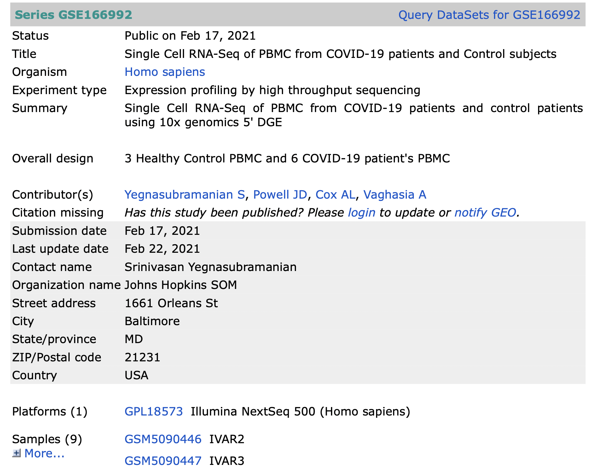

In this vignette, we analyze a COVID dataset housed on the SRA. We use two samples here, but would only need to change the clinical variable input if more samples were run. As of March 20, the SRA dataset is not associated with a publication.

Please refer to the hosted vignette or the github:
[hosted vignette]()
[github link R package]()
[github link bash script]()


```{r, echo=F, out.width = '125%', out.height='125%'}

```

```{r, echo=F, out.width = '125%', out.height='125%'}

```

```{r, include = FALSE, echo=F, warning=F, message=FALSE, results='hide'}
knitr::opts_chunk$set(
  collapse = TRUE,
  comment = "#>",
  fig.width=10, fig.height=10
)
```

```{r setup, echo=F, warning=F, message=FALSE, results='hide'}
#sessionInfo()
library(ScAWS)
# Filtered or raw UMI counts are located in the STAR directory {sample}/Solo.out/Gene/filtered or {sample}/Solo.out/Gene/raw, respectively.
# Data specific variables
# Clinical Variables, must be same length and in the same order as number of sample directories
clinical_variable=c("Control", "COVID19")
clinical_variable_name="COVID19" # What the clinical variable should be named in the Seurat object and graphs

# Lists sample directories generated with STAR
data_directory="~/Desktop/data/"
dirs=list_dirs(data_directory)
# print("Check this is correct:")
# data.frame(clinical_variable, dirs)

# Which reference to use, MonacoImmuneData is a integrated_seurat_object dataset
ref=celldex::MonacoImmuneData()
npcs=30
dims=30

# Preferences
# Set color palette
grey="gray 88"
#scales::show_col(ggsci::pal_nejm("default")(8))
pal=ggpubr::get_palette("npg", k=40)
pal2=ggpubr::get_palette("nejm", k=40)
grey_pal=c("gray 88", pal[1])
bi=pal[c(2,5)]
blend=colorRampPalette(c("white", pal[2]))

# System Settings
set.seed(1)
# Detect number of cores and use future to use parallelized seurat functions
future::plan("multiprocess", workers = parallel::detectCores())
# Increase globals size as Seurat exceeds max size in common use cases
options(future.globals.maxSize = 4000 * 1024^2)
ptsize=0.01;res=500;width=5;height=5;labsize1=5;labsize2=4
```

```{r process, warning=F, message=FALSE, results='hide'}
# # Block to run the pipeline for each sample. Skip this and load from rds.
# 
# # Make list of matrices from STAR output
# star_matrix_list=make_star_matrix_list(dirs, matrix_type = "filtered")
# 
# # Filter, annotate, and scale objects
# seurat_object_list=make_seurat_object_list(star_matrix_list, singler_ref=ref, singler_labels=ref$label.main)
# 
# seurat_object_list=seurat_process_list(seurat_object_list, npcs=npcs, dims=dims)
# 
# # Add clinical variables to objects
# seurat_object_list=add_variable_seurat_object_list(clinical_variable, clinical_variable_name, seurat_object_list)
# 
# # Integrate seurat objects
# integrated_seurat_object=integrate_seurat_object_list(seurat_object_list, npcs=npcs, dims=dims)
```

```{r visualize, echo=F, warning=F, message=FALSE, results='hide'}
load(file="~/Desktop/data/integrated.rds")

# Make subsets of the integrated object for graphing
subset_COVID19=subset(integrated_seurat_object, COVID19=="COVID19")
subset_Control=subset(integrated_seurat_object, COVID19=="Control")

# Graph clinical umaps
clinical_celltype_umap=Seurat::DimPlot(integrated_seurat_object, split.by="COVID19", group.by="celltype", reduction = "umap", pt.size = ptsize, label = T, label.size = labsize2, repel=T, cols=pal) + ggplot2::labs(title=ggplot2::element_blank()) + ggsci::scale_color_npg()

clinical_seurat_clusters_umap=Seurat::DimPlot(integrated_seurat_object, split.by="COVID19", group.by="seurat_clusters", reduction = "umap", pt.size = ptsize, label = T, label.size = labsize1, repel=T, cols=pal) + ggplot2::labs(title=ggplot2::element_blank())
```

```{r umaps, echo=F, warning=F, message=FALSE, results='hide'}
# Graph clinical umaps
clinical_seurat_clusters_umap / clinical_celltype_umap
plot_corrplot_celltype(integrated_seurat_object, col=blend(100))


```

```{r mitochondrial rna, echo=F, warning=F, message=FALSE, results='hide'}
# Graph mitochondrial rna

mito_umap_control=Seurat::FeaturePlot(subset_Control, cols = c(grey, pal[2]), features = "percent.mt", pt.size = ptsize)

mito_vln_control=Seurat::VlnPlot(subset_Control, features = c("nFeature_RNA", "nCount_RNA", "percent.mt"), cols = rep(pal[2], 12), pt.size = ptsize)

mito_umap_COVID19=Seurat::FeaturePlot(subset_COVID19, cols = c(grey, pal[2]), features = "percent.mt", pt.size = ptsize)

mito_vln_COVID19=Seurat::VlnPlot(subset_COVID19, features = c("nFeature_RNA", "nCount_RNA", "percent.mt"), cols = rep(pal[2], 12), pt.size = ptsize)

# Pathchwork annotations
(mito_umap_control/mito_vln_control) + patchwork::plot_annotation(
  title = 'Control')
(mito_umap_COVID19/mito_vln_COVID19) + patchwork::plot_annotation(
  title = 'COVID19')
```

```{r Differential expression between clusters and celltypes, echo=F, warning=F, message=FALSE}
require(org.Hs.eg.db)

#Find DE markers between control and covid
Seurat::Idents(integrated_seurat_object)<-"COVID19"
de_markers=Seurat::FindMarkers(integrated_seurat_object, ident.1 = "Control", ident.2 = "COVID19", test.use="MAST")
de_names=rownames(de_markers)

# Turn DE marker gene names into Entrez ids, bind into a table
annots=AnnotationDbi::select(org.Hs.eg.db, keys=de_names,
                 columns=c("SYMBOL","ALIAS", "GENENAME", "ENTREZID"), keytype="ALIAS")

annot_de=merge(de_markers, annots, by.x="row.names", by.y="ALIAS") # Use this in graphing pathways
de_ids=unique(annots$ENTREZID) # Save entrez ids to input into pathway enrichment

# Check for enriched pathways
enrich=clusterProfiler::enrichKEGG(de_ids, keyType = 'ncbi-geneid')
grep(enrich@result$Description, pattern = "19")
#enrich@result$Description[10]
enrich[1:10][1:7]

# # Rerun without mt genes, gives similar results
# nomt_de_names=de_names[-grep(de_names, pattern = "^MT-")]
# # Get Entrez ids from aliases
# annots=AnnotationDbi::select(org.Hs.eg.db, keys=nomt_de_names,
#                  columns=c("SYMBOL","ALIAS", "GENENAME", "ENTREZID"), keytype="ALIAS")
# de_ids=unique(annots$ENTREZID)
# 
# enrichd=clusterProfiler::enrichKEGG(de_ids, organism="hsa", keyType = 'ncbi-geneid')
# grep(enrichd@result$Description, pattern = "19")
# enrichd@result$Description[10]
annot_graph=annot_de[!is.na(annot_de$ENTREZID),] # Remove rows with na in entrezid
```

```{r make pathview figure}
# tab <- annot_graph$avg_log2FC
# names(tab) <- annot_graph$ENTREZID
# pathview::pathview(gene.data = tab,
#          pathway.id = "hsa05171",
#          species = "hsa",
#          limit = list(gene=5, cpd=1))

```

```{r pathview figure}
knitr::include_graphics("./hsa05171.pathview.png")
```

```{r Drug Gene Interaction of DE Genes}
require(rDGIdb)
result <- queryDGIdb(de_names, geneCategories = "CLINICALLY ACTIONABLE")
result@resultSummary$Gene["AP1"]
result@resultSummary$Gene

```
Early work checking KEGG for a covid19 pathway. The blocks below first check that the coronavirus pathway is available in the r package by getting the http page from KEGG, parsing the page, and inputting the genes into the enrichment test function. It is available (KEGGREST::keggGet("hsa05171")), and we see that there is overlap between the coronavirus pathway with other viral pathways.

```{r kegg parser}
require(httr)
require(rvest)
require(dplyr)

# Get http get response
http=httr::GET("https://www.genome.jp/dbget-bin/get_linkdb?-t+genes+path:hsa05171")
html=rvest::minimal_html(http)

# Parse and clean up into vectors, create data frame
html_text=html %>% html_element("pre") %>% html_text2()
text=strsplit(html_text, split="\n"); text=text[[1]][3:length(text[[1]])] #split by newline

hsa_vector=vector()
description_vector=vector()
refseq_list=list()
for (i in 1:length(text)){
  processing=strsplit(text[i], split = "\\s\\s+") # Isn't a tab, but a varying number of spaces. Split by >1 consecutive spaces, as one would split the string on each word.
  # hsa_vector[i]=strsplit(processing[[1]][1], split=":")[[1]][2] #  Split by ':', take the fragment directly following the colon
  hsa_vector[i]=processing[[1]][1]
  processing=processing[[1]][2] # Take what's left over and split into other notations
  description_vector[i]=strsplit(processing, split = " | (RefSeq) ", fixed = T)[[1]][1] # Get Description of the hsa
  refseq=strsplit(processing, split = " | (RefSeq) ", fixed = T)[[1]][2] # Get refseq names
  refseq=strsplit(refseq, split = ";", fixed = T)[[1]][1] # Split off the long refseq name
  refseq=trimws(refseq, which = "both", whitespace = "\\s")# Remove starting or trailing space if present
  refseq=strsplit(refseq, split = ", ", fixed = T) # Split the leftover gene names into separate elements
  refseq_list[[i]]=refseq
}

refseq_flat_list=unlist(refseq_list) # Flatten list to get all gene names
# hsa_vector; description_vector; refseq_list; refseq_flat_list
```


```{r KEGG, echo=F, warning=F, message=FALSE}
# # Make HSAs into entrez ids
# kegg_gene_ids=vector()
# for (i in 1:length(hsa_vector)){
#   get=KEGGREST::keggGet(c(hsa_vector[i]))[[1]]$DBLINKS[1]
#   kegg_gene_ids[i]=strsplit(get, split = ": ", fixed = T)[[1]][2]
# }
# 
# enrich=clusterProfiler::enrichKEGG(kegg_gene_ids)
# enrich@result$Description[1:10]
```


